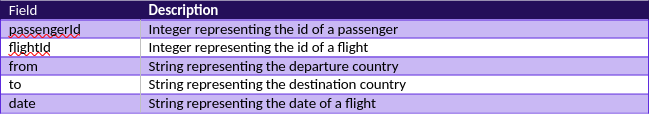
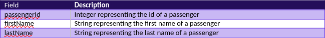

# Spark Assignment for Coding assignment from Quantexa
This is the spark-scala assignment repositories for keeping all codes for reference and evaluation.
- URL: https://github.com/agileox/assignmentSpark
- git clone https://github.com/agileox/assignmentSpark.git
 
21/10/2024, by: Adi Yusman - _Agileox_

**Table of content**
- [Description](#description)
- [Method](#method)
- [The Questions](#the-questions)
- [Reference](#reference)

## Description
The assignment has been split into 4 questions; I had been given 2 sets of data as below:

flightData.csv



passengers.csv



## Method

### Installing of the Java JDK 1.8
### Installing of the spark-2.4.8
### Installing of the scala-2.12.10

## The Questions

### Q1 - Find the total number of flights for each month.
Description
The spark-scala script were develop for getting the total number of flights from the dataset and group by month. The challenge here is to convert the date format to a proper function to get month details and group by month to get the total number of flights.

Code
```spark-scala
// the library required byt the code
import org.apache.spark.sql.SparkSession
import org.apache.spark.sql.functions._
import org.apache.spark.sql.types._

// Create Spark Session
val spark = SparkSession.builder.appName("ReadCSV").getOrCreate()

// Read CSV file and cast data types as it read the csv as text file
val df = spark.read
  .option("header", "true")
  .csv("/home/agileox/Project/assignmentSpark/data/flightData.csv")
  .withColumn("passengerId", col("passengerId").cast(IntegerType))
  .withColumn("flightId", col("flightId").cast(IntegerType))
  .withColumn("date", col("date").cast(DateType))

// Extract year and month, and group by them -> this is where the date being converted to month
val flightCountByMonthDF = df.groupBy(month(col("date")).alias("Months")) // the conversion function happen
  .agg(count("flightId").alias("Number_Of_Flights"))
  .orderBy(col("Months")) // Order by month

// Show the grouped data
// flightCountByMonthDF.show() // for showing the data in terminal but will remark for keeping it into csv file output

// Save the output to a file (e.g., in CSV format)
flightCountByMonthDF.coalesce(1)
  .write
  .option("header", "true") // Write the header
  .csv("/home/agileox/Project/assignmentSpark/output/No_Of_Flight_Each_Months") //output file location

// Stop the Spark session
spark.stop() // Stop the Spark context
System.gc() // Suggest garbage collection
```

Execute the command
```bash
$ spark-shell -i Q1.scala --driver-memory 1g --executor-memory 1g
```

Sample-Result
```csv
Months,Number_Of_Flights
1,9700
2,7300
3,8200
4,9200
5,9200
6,7100
7,8700
8,7600
9,8500
10,7600
11,7500
12,9400
```

### Q2 - Find the names of the 100 most frequent fliers
Description
The assignment Q2 is to get the frequent fliers form the data sets and to do the merge 2 datasets given to give the output required. After doing the code for getting the output, there are challenges like joined features, group by passengers ID and finally the output come out with no 100 most frequent fliers. The most is 32.

Code
```spark-scala
//library required for spark scala
import org.apache.spark.sql.SparkSession
import org.apache.spark.sql.functions._
import org.apache.spark.sql.types._

// Create Spark Session
val spark = SparkSession.builder.appName("ReadCSV").getOrCreate()

// Read CSV file for flights and cast data types
val flightsDF = spark.read
  .option("header", "true")
  .csv("/home/agileox/Project/assignmentSpark/data/flightData.csv") //read csv data location
  .withColumn("passengerId", col("passengerId").cast(IntegerType))
  .withColumn("flightId", col("flightId").cast(IntegerType))
  .withColumn("date", col("date").cast(DateType))

// Read the passengers CSV file
val passengersDF = spark.read
  .option("header", "true")
  .csv("/home/agileox/Project/assignmentSpark/data/passengers.csv") //read csv data location
  .withColumn("passengerId", col("passengerId").cast(IntegerType)) // Ensure passengerId is of the correct type

// Join the flights DataFrame with the passengers DataFrame
val joinedDF = flightsDF.join(passengersDF, Seq("passengerId"), "inner") // Inner join on passengerId - Join both table function

// Group by passengerId, firstName, and lastName, and count occurrences
val countByPassengerDF = joinedDF.groupBy("passengerId", "firstName", "lastName")
  .agg(count("*").alias("Number_of_Flights")) // Count the number of rows for each group
  .orderBy(desc("Number_of_Flights")) // Order by flightCount in descending order

// Show the grouped and counted data
//countByPassengerDF.show() //to show output in terminal - remark at the moment

// Optionally, save the count output to a file
countByPassengerDF.coalesce(1)
  .write
  .option("header", "true") // Write the header
  .csv("/home/agileox/Project/assignmentSpark/output/Most_Frequent_Fliers") // output location

// Stop the Spark session
spark.stop() // Stop the Spark context
System.gc() // Suggest garbage collection
```

Execute the command
```bash
$ spark-shell -i Q2.scala --driver-memory 1g --executor-memory 1g
```

Sample-Result
```csv
passengerId,firstName,lastName,Number_of_Flights
2068,Yolande,Pete,32
1677,Katherina,Vasiliki,27
4827,Jaime,Renay,27
3173,Sunshine,Scott,26
8961,Ginny,Clara,26
917,Anisha,Alaine,25
288,Pamila,Mavis,25
5096,Blythe,Hyon,25
760,Vernia,Mui,25
6084,Cole,Sharyl,25
8363,Branda,Kimiko,25
5867,Luise,Raymond,25
2857,Son,Ginette,25
3367,Priscilla,Corie,24
1343,Bennett,Staci,24
1240,Catherine,Missy,24
2441,Kayla,Rufus,24
5668,Gladis,Earlene,24
3405,Johna,Ollie,23
```
### Q3 - Find the greatest number of countries a passenger has been in without being in the UK. 
Description
For example, if the countries a passenger was in were: UK -> FR -> US -> CN -> UK -> DE -> UK, the correct answer would be 3 countries. This is the most challenging question where I need to do the Union first to combine the data and 

Code
```spark-scala
import org.apache.spark.sql.SparkSession
import org.apache.spark.sql.expressions.Window
import org.apache.spark.sql.functions._

    // Initialize Spark Session
    val spark = SparkSession.builder()
      .appName("Country Visit Analysis")
      .getOrCreate()

    import spark.implicits._

    // Read the data from CSV file
    // Make sure the CSV has columns: passengerId, from, to, date
    val filePath = "/home/agileox/Project/assignmentSpark/data/flightData.csv"  // Update with the actual file path
    val data = spark.read.option("header", "true")
      .option("inferSchema", "true")
      .csv(filePath)

    // Combine "from" and "to" into a sequence of countries visited
    val flights = data.select($"passengerId", $"to".as("country"), $"date")
      .union(data.select($"passengerId", $"from".as("country"), $"date"))
      .orderBy("passengerId", "date")

    // Define a window partitioned by passengerId and ordered by date
    val windowSpec = Window.partitionBy("passengerId").orderBy("date")

    // Add a column that marks when a passenger revisits the UK
    val flightsWithUKFlag = flights
      .withColumn("isUK", when($"country" === "uk", 1).otherwise(0))
      .withColumn("uk_group", sum("isUK").over(windowSpec))

    // Now, filter out only sequences where the country is not UK
    val nonUKFlights = flightsWithUKFlag
      .filter($"country" =!= "uk")
      .withColumn("country_list", collect_set($"country").over(windowSpec.partitionBy($"uk_group")))

    // Find the maximum number of countries visited without revisiting the UK
    val result = nonUKFlights
      .groupBy("passengerId", "uk_group")
      .agg(size(collect_set($"country")).as("country_count"))
      .groupBy("passengerId")
      .agg(max($"country_count").as("Longest_Run"))

    // Show the results
    // result.show()

    // Save the output to a file (e.g., in CSV format)
    result.coalesce(1)
    .write
    .option("header", "true") // Write the header
    .csv("/home/agileox/Project/assignmentSpark/output/Longest_Run_Non_UK")

    // Stop the Spark session
    spark.stop()
    System.gc()
```

Execute the command
```bash
$ spark-shell -i Q3.scala --driver-memory 1g --executor-memory 1g
```

Sample-Result
```csv
passengerId,Longest_Run
148,11
463,5
471,9
496,3
833,14
1088,6
1238,8
1342,12
1580,8
1591,12
1645,8
1829,11
1959,3
2122,7
2142,5
2366,4
2659,2
2866,3
3175,8
```
### Q4 -
Description
Code
```spark-scala
import org.apache.spark.sql.SparkSession
import org.apache.spark.sql.functions._
import org.apache.spark.sql.types._
import org.apache.spark.sql.expressions.Window

// Initialize Spark session
val spark = SparkSession.builder.appName("PassengerPairs").getOrCreate()

// Read the CSV data
val df = spark.read
  .option("header", "true")
  .csv("/home/agileox/Project/assignmentSpark/data/flightData.csv")
  .withColumn("passengerId", col("passengerId").cast(IntegerType))
  .withColumn("flightId", col("flightId").cast(IntegerType))
  .withColumn("date", col("date").cast(DateType))

// Group by flightId to get the passengers for each flight
val passengersPerFlightDF = df.groupBy("flightId")
  .agg(collect_list("passengerId").alias("passengers"))

// Create pairs of passengers for each flight and count flights together
val passengerPairsDF = passengersPerFlightDF
  .select(explode(col("passengers")).alias("passenger1"), col("passengers")) // Explode to get individual passengers
  .withColumn("passenger2", explode(col("passengers"))) // Create pairs by exploding again
  .filter(col("passenger1") < col("passenger2")) // Keep unique pairs (to avoid duplicates)
  .groupBy("passenger1", "passenger2")
  .agg(count("passenger2").alias("Number_Of_Flights_Together")) // Count how many flights they took together

// Sort the results by Number_Of_Flights_Together in descending order
val sortedPassengerPairsDF = passengerPairsDF
  .orderBy(desc("Number_Of_Flights_Together")) // Sort by Number_Of_Flights_Together in descending order

// Show the result
//sortedPassengerPairsDF.show(truncate = false)

// Save the output to a file (e.g., in CSV format)
sortedPassengerPairsDF.coalesce(1) // Ensure single file output
  .write
  .option("header", "true") // Write the header
  .csv("/home/agileox/Project/assignmentSpark/output/Passenger_Pairs_Flights_Together") // Specify output location

// Stop the Spark context and suggest garbage collection
spark.stop()
System.gc()
```

Execute the command
```bash
$ spark-shell -i Q4.scala --driver-memory 1g --executor-memory 1g
```

Sample-Result
```csv
passenger1,passenger2,Number_Of_Flights_Together
701,760,15
3503,3590,14
2717,2759,14
2939,5490,13
2939,4395,12
7877,9252,12
760,763,12
701,763,12
1337,1484,12
2759,4316,12
366,374,12
1208,3093,12
2550,4441,12
4316,4373,12
4395,4399,12
3278,5423,12
1337,2867,12
3021,9522,12
2926,3590,12
```

## Reference

- [^ Top](#spark-assignment-for-coding-assignment-from-quantexa)
